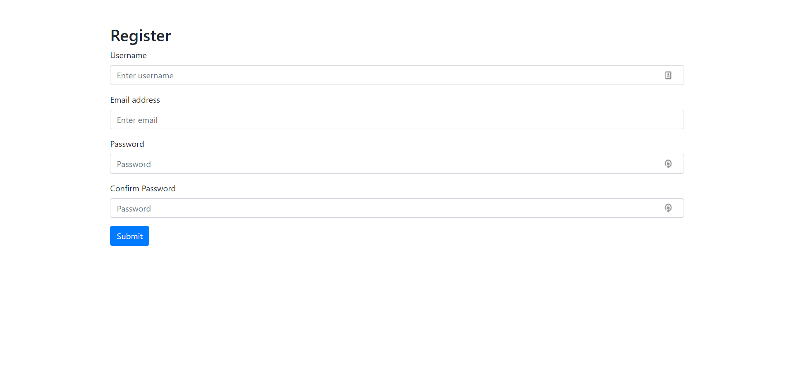

# Server side validation with express validation
Now that you have done some readings on validation, it's time to practice, in this activity we will specifically utilize the express-validator package to validate a registration form. The objectives of this assignment are:
1. Understanding how to use express-validator with express
2. Practicing different validation types
3. Practicing writing custom validations

## Setup
1. Open your terminal and navigate to your dedicated assignments folder.
2. Then clone this assignment repo on your local machine.
3. Now open the assignment folder on VSCode.

We already started the `app.js` file for you. it includes:
1. Initial setup for your Express server.
2. A GET request to `/` which renders the `index.ejs` file we included in your `views` folder
3. A variable called `usedEmails` will come to use during your validation.

**NOTE**: Please don't make any change to the `usedEmails` variable in the code.

Let’s test our app out! Start the app by running `npm start`. Now visit `http://localhost:3000` on the browser, you should be able to see this:

Now that you have the starter code for this assignment, it's time to do some Googling and validate each user input. We advise you to keep the documentation open while working on this activity[Express-validator](https://express-validator.github.io/docs/).

### Requirements
1. Validate all user inputs
2. Show alerts in case of incorrect inputs
3. Save emails of successful registers

HINT: Using the `check()` function that `express-validator` provide for us you will need to create the following validations, in case the user does not pass validations you will have to pass a variable to your EJS template and render specific alerts for the user (We already know how to do that form the Meme website activity).

#### Part 1: Validating the username
The username should passe the following requirements:
1. Must be at least 4 characters long
2. Should not include spaces
3. Should not be empty
If a user fails any of these validations you will have to output specific alerts to inform the user your alerts should be as follow:
1. 'Username must be atleast 4 characters long'
2. 'Username should not include spaces'
3. 'Username should not be empty'

NOTE: make sure to make use of the [Bootstrap alert component](https://getbootstrap.com/docs/4.0/components/alerts/)

#### Part 2: Validating the email
The email should passe the following requirements:
1. Should be unique: here you will use custom validation to check the usedEmails array
2. Should be in email format
3. Should not be empty
If a user fails any of these validations you will have to output specific alerts to inform the user your alerts should be as follow:
1. 'Email already exists'
2. 'Invalid email'
3. 'Email should not be empty'

#### Part 3: Validating the password
The password should passe the following requirements:
1. Must be 5+ characters containing a number, uppercase, and lowercase
2. Should match the confirmed password input: here you will use custom validation to compare the 2 passwords
If a user fails any of these validations you will have to output specific alerts to inform the user your alerts should be as follow:
1. 'The password must be 5+ chars long and contain a number, uppercase and lowercase'
2. 'Passwords are not matching'

#### Part 4: Sucessful validation!
Phew, the user has finally passed all our validation now its time for us to add the registered email:
- Show a success alert to the user saying "Congratulations, your account has been successfully created"
- Using the request body, push a new Meme to our `memes` array.
- As a response, redirect the user to our home page `/`.
- You should be able to see the new meme on the home page.

### Submission
Run `npm test` to test your code. If it shows all tests have passed then you're good to go.

Since this is a group assignment and you will be sharing the assignment repo with your group member, you can perform intermediate commits and pushes as required to share your code within your group.

Once you're ready to submit the assignment, follow these steps on your terminal:
1. Stage your changes to be committed: `git add .`
2. Commit your final changes: `git commit -m "solve assignment"`
3. Push your commit to the main branch of your assignment repo: `git push origin main`

After your changes are pushed, return to this assignment on Canvas for the final step of submission.

## Conclusion
Now you know how to validate user input and handle different types of errors.

There is another famous validation package called [Joi](https://dev.to/itnext/joi-awesome-code-validation-for-node-js-and-express-35pk) make sure to check it out.

---
## References
- https://express-validator.github.io/docs/check-api.html